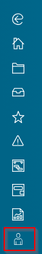
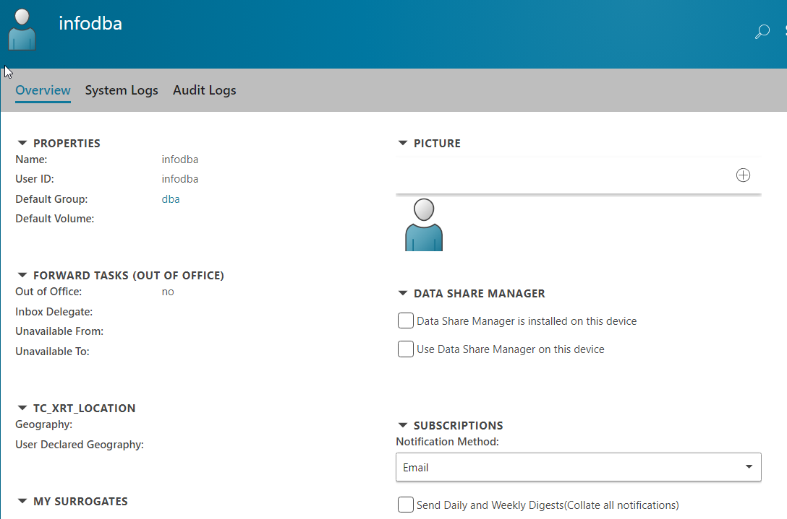

# UserProfileLinkcmdGlobal
Meant for Active Workspace 4.0+



clicking the command sends you to the users profile:



This creates a global command (top in 4.0, left side in 4.1+ ux redesign) for the user profile.  Instead of having to get to your user profile from other locations it is located a global command that can be accessed from anywhere in the client.  

Combine this with the [syslog example](https://github.com/ActiveWorkspaceExtensions/showSyslog) and you can make the link take the user directly to the syslog if wanted.

you just need to add the showSyslog module and add the page to your userprofile xrt and change the action showUserProfileLink:

```JSON
            "showUserProfileLink": {
                "actionType": "Navigate",
                "navigateTo": "com_siemens_splm_clientfx_tcui_xrt_showObject",
                "navigationParams": {
                    "uid": "{{ctx.user.uid}}",
                    "cmdId": "{{commandContext.cmdId}}",
                    "cmdArg": "{{commandContext.cmdArgs}}"
                }
            }
```

You really just need to add a pageId to the navigationParams:

```JSON
            "showUserProfileLink": {
                "actionType": "Navigate",
                "navigateTo": "com_siemens_splm_clientfx_tcui_xrt_showObject",
                "navigationParams": {
                    "pageId": "System_Logs",
                    "uid": "{{ctx.user.uid}}",
                    "cmdId": "{{commandContext.cmdId}}",
                    "cmdArg": "{{commandContext.cmdArgs}}"
                }
            }
```

This allows you to navigate to any pageId in any stylesheet or object you are opening up, in this situation the object is a user object and the stylesheet is the user stylesheet with the System_Logs page